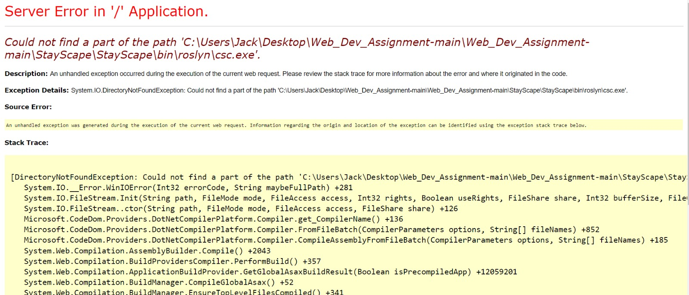

# Prerequisite
1. Node Installed https://nodejs.org/en/download/current
2. Visual Studio
<br/>


# Step to run our project
1. Change directory to this project directory
2. Install dependency
```
npm i
```
2. Build tailwind css folder
```
npm run build:css
```
OR Watch Changes of the tailwind css
```
npm run watch:css
```
3. Clean and Rebuild Solution in Visual Studio
4. Run the Program
5. If encounter error, you may consider to update the package

```
Update-Package Microsoft.CodeDom.Providers.DotNetCompilerPlatform -r
```
<br/>


# Test Data
### Customer (Email & Pwd)
```
Customer@gmail.com
W123.90a

Customer2@gmail.com
W123.90a

Customer3@gmail.com
W123.90a

Customer4@gmail.com
W123.90a

Customer5@gmail.com
W123.90a
```

### Host (Email & Pwd)
```
Host@gmail.com
W123.90a

Host2@gmail.com
W123.90a
```

### Card Payment
Card Number
```
4242424242424242
```
Expire Date
```
12/34
```
CVC
```
111
```
For more information: https://docs.stripe.com/testing
